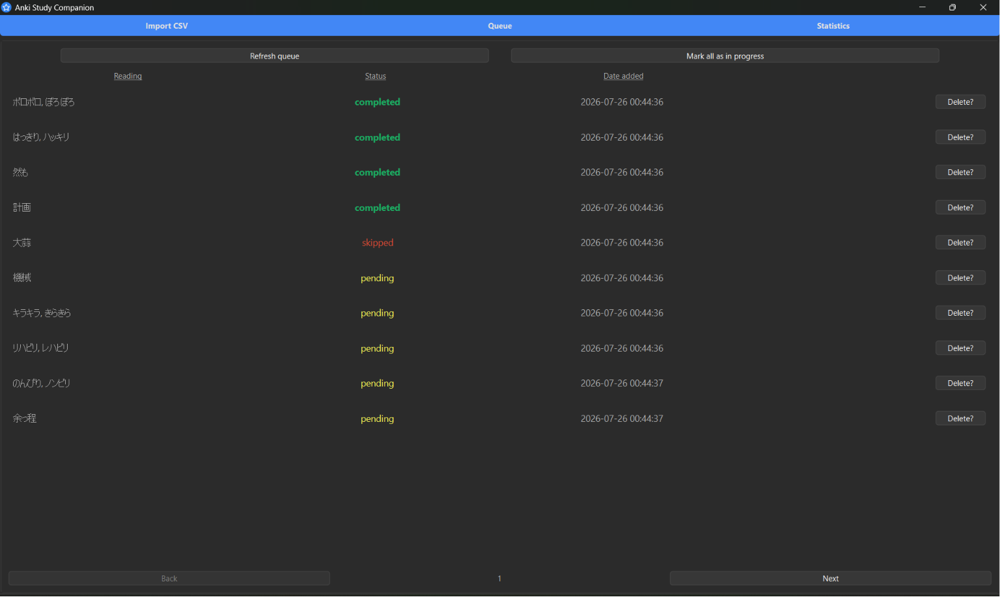
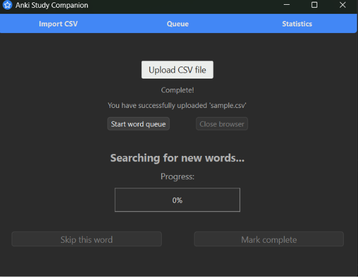
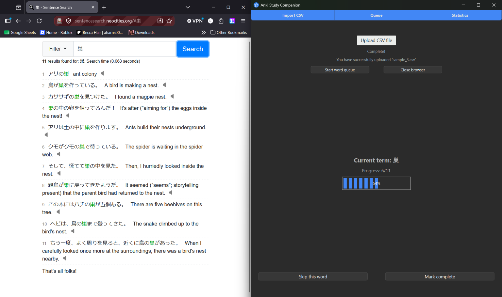
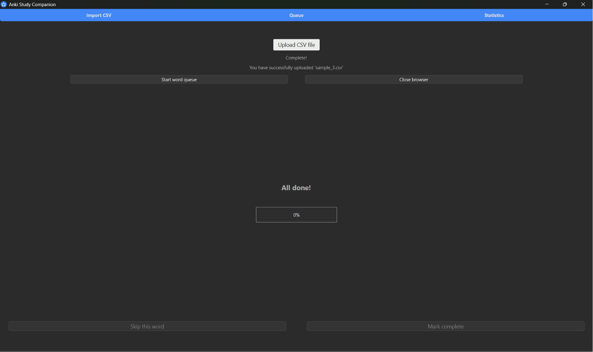
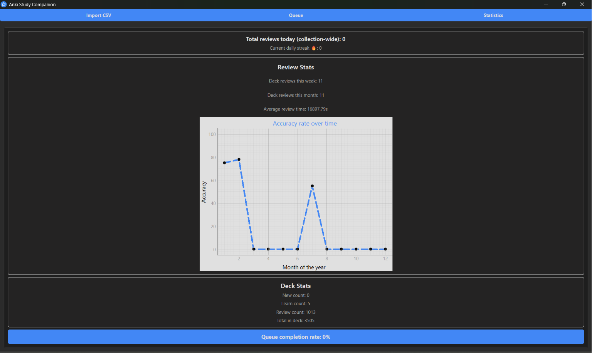

<div align="center" id="top">
    
    <h1 align="center">Anki Study Companion</h3>
</div>

<details>
    <summary>Tables of Contents</summary>
    <ol>
        <li><a href="#about-the-project">About The Project</a></li>
        <ul>
            <li><a href="#built-with">Built With</a></li>
        </ul>
        <li><a href="#getting-started">Getting Started</a></li>
        <ul>
            <li><a href="#prerequisites">Prerequisites</a></li>
            <li><a href="#installation">Installation</a></li>
        </ul>
        <li><a href="#usage">Usage</a></li>
        <li><a href="#what-i-learned">What I Learned</a></li>
        <li><a href="#future-improvements">Future Improvements</a></li>
    </ol>
</details>


## About The Project 💻
<div align="center">
    
</div>

**Anki Study Companion** is a PyQt6 desktop tool that automates vocabulary card creation for Japanese language learners. Users upload a CSV of vocabulary and the app drives an automated browser session *(powered by the Yomitan browswer extension)* that looks up each word on a sentence-search site, eliminating the need to search for each word manually.

Beyond its automation, the app includes a persistent, queue-based tracking system *(built on SQLite)* so users can moniter which words are pending, in progress, completed, or skipped across sessions, along with a statistics dashboard that visualizes review accuracy, streaks, and deck stats over time.

Many language learners track new vocabulary in spreadsheets, however, I've found that this manual process is often slow, disconnected, and distracts learners from meaningful study. So, I've created this tool to close that gap: turning a simple word list into ready-to-study Anki cards with minimal manual effort, while giving learners visible insight into their study progress as they go.

**Key Features:** 
* CSV import for bulk vocabulary uploads
* Automated browser-driven word lookup and Anki card creation (via Yomitan)
* Persistent queue tracking of word status (pending/processing/completed/skipped)
* Statistics dashboard: review accuracy, streaks, and deck stats

<p align="right">(<a href=#top>back to top</a>)</p>


### Built With 🔨

* 
* 
* 
* 
* 

In addition, uses `PyQtGraph` for data visualization and Python's `requests` library for AnkiConnect API calls.

<p align="right">(<a href=#top>back to top</a>)</p>


## Getting Started 🚀
This contains important information regarding installation instructions and configuring proper setup.

### Prerequisites
* Requires Python 3.10+.
* Set up a virtual environment.
```sh
py -m venv venv
```
* Activate it.
```sh 
# Windows
venv\Scripts\activate

# macOS/Linux
source venv/bin/activate
```
* Install `requirements.txt`.
```sh
py -m pip install -r requirements.txt
```
* [Anki](https://apps.ankiweb.net/) desktop app, installed and running.
* [AnkiConnect](https://ankiweb.net/shared/info/2055492159) add-on installed in Anki (Tools > Add-ons > Get Add-ons... > code `2055492159`).
* Firefox, with the Yomitan extension installed.
* CSV files should have 3 columns: term, reading, and definition (no header row). If a row's term column is empty, the reading will be used in its place.
```
猫,ねこ,cat
,いぬ,dog
```

### Installation
1. Clone the repo.

```sh
git clone https://github.com/Lays1206/Anki-Study-Companion.git
```

2. Enter Firefox profile path (with Yomitan extension) in `automation/browser.py`. You can find this via `about:support` in Firefox, under "Profile Folder".

```py
profile_path = r"ENTER YOUR PROFILE"
```

3. Enter your preferred Anki deck name in `main.py` (deck must already exist).

```py
window = MainWindow(db, anki, "ENTER DECK NAME")
```

4. Run the app, passing the path to your database as a command-line argument. The main application window will open once the script executes.

```py
py main.py data/your_database_file.db
```

> [!NOTE]
> If the database file doesn't exist yet, it will be created automatically at the provided path.

<p align="right">(<a href=#top>back to top</a>)</p>


## Usage 📑

 </br>
The image above demonstrates a CSV import and browser instance initalizing in the import tab. This will go through the process of checking words in the database against words already in the user's chosen Anki deck. If unadded terms exist in the database, then the driver will open an automated instance of Firefox in a separate window. If any terms in an uploaded file already exist in the chosen deck, the browser initalization automatically removes them from the database and updates the queue.

 </br>
In this split-screen display, notice the progress bar indicating the user's progress in the queue and the sentence search's returned results for the current term. Keep in mind, not all words will return sentence results, as these sites have only a select few resources to pull from.

> [!NOTE]
> The sentence-search site provided is optional and can be replaced with another of your choosing in `automation/browser.py`

 </br>
When a browser session is closed, the progress bar will reset to zero. But, in the case that all words in the queue are either skipped or completed during a session, the screen will display the `All done!` text.

 </br>
In the queue tab, pages will display at most 10 terms with accompanying columns for status and date added, as well as an optional button for dynamically removing words from the database/queue. In addition to when the browser is initalized, the queue can manually be refreshed after a file upload to remove already existing terms. Another feature showcased here is the `Mark all as in progress` button, which resets the status of all terms in the database/queue, so be mindful when performing this action.

 </br>
On the statistics display, users can view their total number of reviews, a daily-updated review streak, a breakdown of weekly/month reviews and average review time/accuracy, as well as deck composition stats. Also, take note of the queue completion rate at the bottom of the tab: this computes the percentage ratio of words completed in the queue vs. its total.


## What I Learned 📚

* How to design a SQLite schema to track and query items in different states (pending, processing, completed, skipped)
* How to build a paginated queue interface through live database queries
* How to use PyQt's signal/slot system to decouple widgets > letting one tab (`Import`) emit signals to another (`Queue`) without either needing a direct reference to the other

## Future Improvements ⭐

* Move long-running operations (browser automation, file imports, queue refreshes) off the main thread to keep the GUI responsive
* Expand the statistics dashboard with more detailed breakdowns of study data
* Allow users to select their Anki deck directly through the GUI, replacing the hardcoded selection


